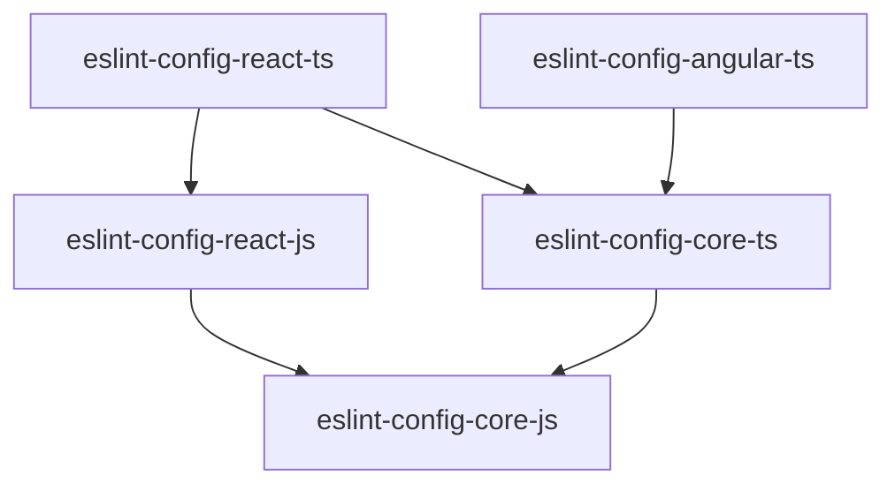

# Infinum JS Linters

ESLint and TSLint extensible shareable configs based on Infinum JavaScript Team's [coding styles and guidelines](https://infinum.com/handbook/books/frontend).

## ESLint package dependencies

## License

The [MIT License](LICENSE)

## Credits

js-linters is maintained and sponsored by
[Infinum](https://www.infinum.com).

